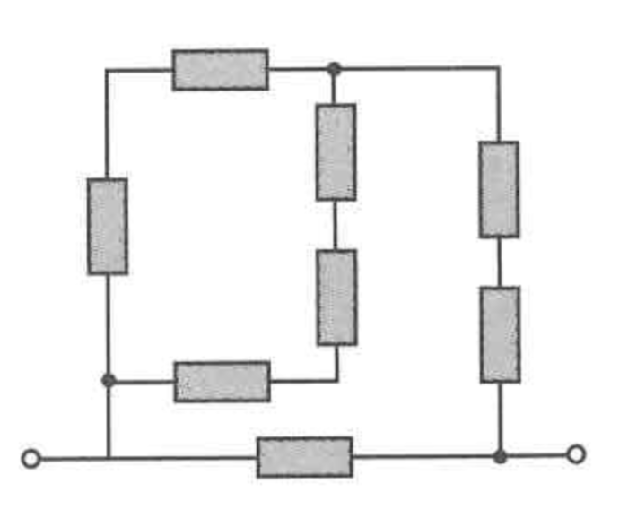
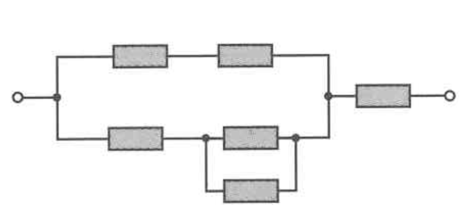
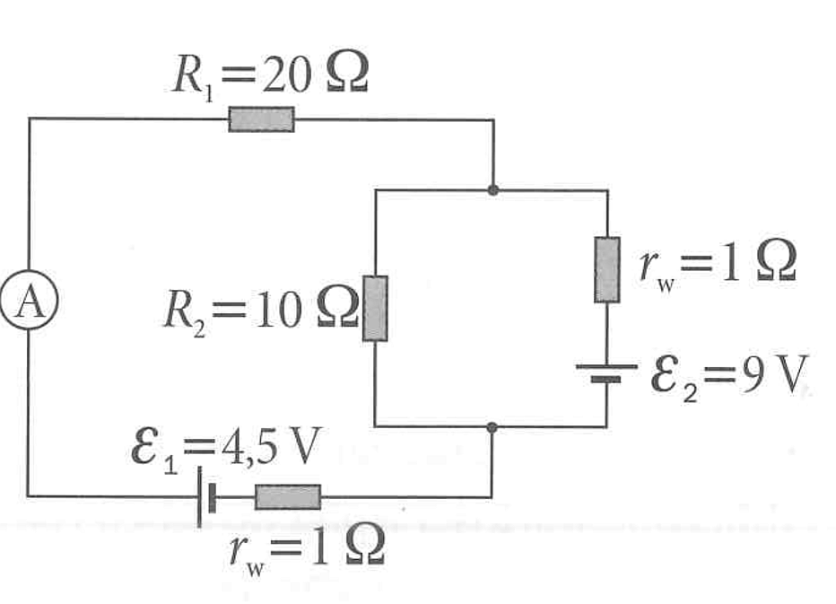
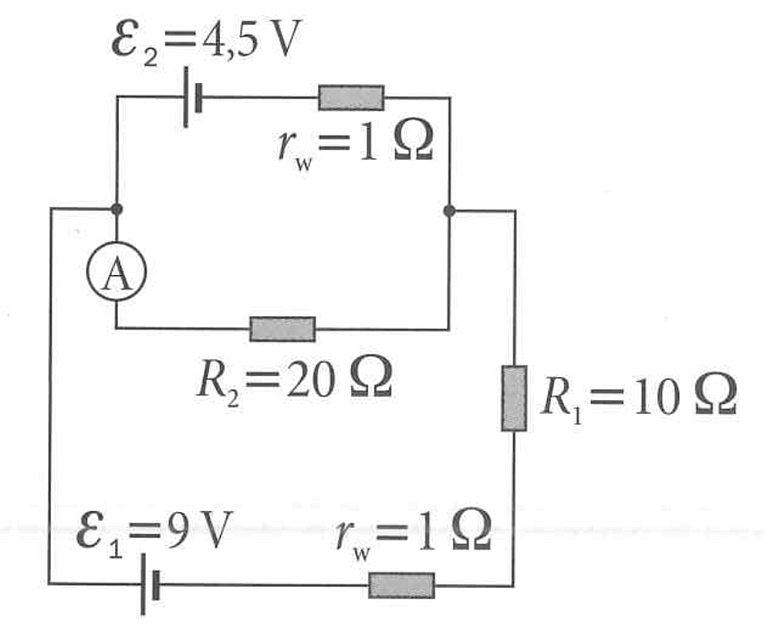

# Section 6: Circuits

Your soultions go here!!!!

---

Below it is just a copy of the tasks, so you can easily navigate to the task you want to solve. You can also use the links in the sidebar to navigate to the tasks.

## 1. Series and Parallel Circuit

You have three resistors, $R_1=15\,\Omega$, $R_2=30\,\Omega$, and $R_3=50\,\Omega$ and a 12 V battery. Consider case when they are all connected in series and when all of them connected in parallel. Calculate the total equivalent resistance in each case. Calculate the current flowing from the battery in each case.

## 2. Resistors

You have a supply of exactly three $1\,\Omega$ resistors. What are all the possible equivalent resistances you can create by combining them? List all unique values.

## 3. Mixed Circuit

Calculate the equivalent resistance for the circuit shown in the figure. All resistors have a resistance of $5\ \Omega$.

## 4. Mixed Circuit

Calculate the equivalent resistance for the circuit shown in the figure. All resistors have a resistance of $10\ \Omega$.

## 5. Kirchhoff's Laws

Using Kirchhoff’s laws, find the currents $I_1$, $I_2$, $I_3$ (going through the resistors $R_1$, $R_2$, $R_3$ respectively) in the following two-loop circuit:

- Left loop: ammeter $A$, top resistor $R_1 = 20\,\Omega$, and bottom source $\mathcal{E}_1 = 4.5\,\text{V}$ in series with internal resistance $r_w = 1\,\Omega$.
- Right loop: source $\mathcal{E}_2 = 9\,\text{V}$ in series with internal resistance $r_w = 1\,\Omega$.
- Shared branch: resistor $R_2 = 10\,\Omega$ connecting the top-right node to the bottom node.

## 6. Kirchhoff's Laws again

Calculate the current flowing through the ammeter.

## 7. Capacitors in Parallel

Two capacitors, $C_1=4\,\mu\text{F}$ and $C_2=6\,\mu\text{F}$, are connected in parallel to a 10 V battery. What is the total charge stored on the capacitors? What is the total energy stored?

## 8. AC Voltage Equation

The current in an AC circuit is given by $I(t) = 2 \sin(120\pi t)$. If the circuit consists of a single $50\,\Omega$ resistor, what is the equation for the voltage $V(t)$ across it?

## 9. Current

Charge flowing through the wire is given by the function of time $Q(t) = 5t^2+5$. What is the current at $t=3$ s?

## 10. Average Current

A lightning bolt transfers a charge of 30 Coulombs to the ground in a time of 2 milliseconds. What is the average current of the lightning bolt?

## 11. Power & Energy

What is the power dissipated by a $100\,\Omega$ resistor when a voltage of 50 V is applied across it? How much energy is consumed in 5 minutes?

## 12. Transformer Currents

A transformer has a primary coil with 1000 turns and a secondary coil with 200 turns. If the primary voltage is $120\text{ V}$ (AC), what is the secondary voltage? If the current in the secondary is $3\text{ A}$, what is the current in the primary?

## 13. Transformer Ratio

A transformer is used to step down the voltage from 120 V AC to 9.0 V AC. If the primary coil has 400 turns, how many turns must the secondary coil have?

## 14. RLC Circuit

Write down the differential equation for a series RLC circuit with a voltage source $V$, a resistor $R$, an inductor $L$, and a capacitor $C$. Assume the current is $I(t)$ and the voltage across the capacitor is $V_C(t)$. Compare this to the equation of a damped harmonic oscillator. What are the analogies between the terms in the two equations?

## 15. Resistor Cube*

A cube is constructed from 12 identical resistors on its edges, each with resistance R. What is the equivalent resistance between two opposite corners of the cube?